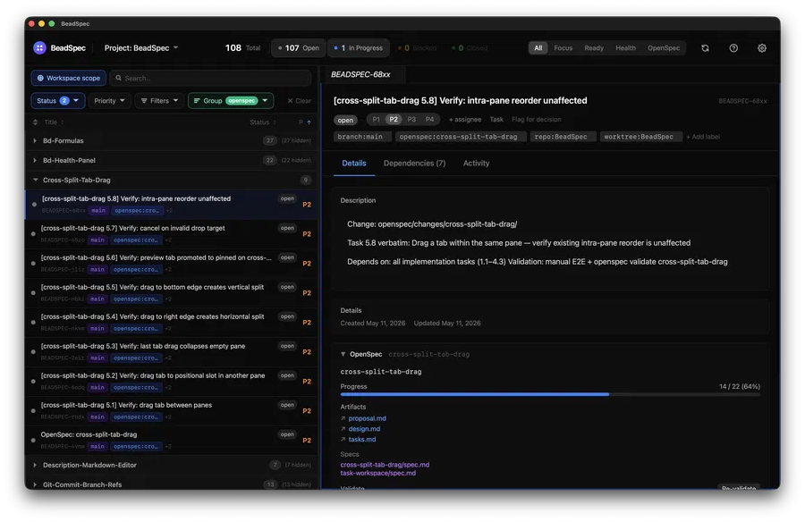

# BeadSpec

> A native desktop GUI for the [Beads](https://github.com/gastownhall/beads) issue tracker — visualize dependencies, manage issues visually, and browse OpenSpec changes without leaving your workflow.

[](https://github.com/boardthatpowder/BeadSpec/actions/workflows/ci.yml)
[](https://github.com/boardthatpowder/BeadSpec/releases/latest)
[](#license)
[](#install)
[](https://tauri.app/)



---

## Why BeadSpec?

- **See the whole picture** — dependency graphs, workspace tabs, and views that would take dozens of `bd` commands to reconstruct mentally.
- **Stay in flow** — a global quick-capture shortcut and system tray let you log issues without switching apps.
- **Spec-first** — BeadSpec is the only Beads GUI that surfaces [OpenSpec](https://github.com/gastownhall/openspec) change proposals alongside your task list. Browse in-flight specs, see which Beads issues were imported from a change, and validate implementation status — without leaving the app. If you use OpenSpec to drive development, BeadSpec closes the loop between "what we agreed to build" and "what's been built."

BeadSpec is a frontend. The `bd` CLI remains the source of truth — BeadSpec reads Dolt SQL directly for speed and writes through `bd` to preserve its hook logic, ID assignment, and branch tracking.

---

## Features

### Core features

| Feature | Description |
|---|---|
| Task list | Grouped, filtered, virtualized issue list with inline editing and bulk actions |
| Dependency graph | Interactive visual graph (React Flow + Cytoscape.js) |
| Workspace tabs | IDE-style multi-tab split-pane layout |
| Command palette | `⌘K` / `Ctrl+K` — fuzzy search across tasks, views, and actions |
| Health & formulas | Run `bd` diagnostics and pour workflow formulas from the UI |
| Human decision queue | Flag and respond to issues requiring human decisions |
| Quick capture | Global shortcut opens a floating issue-creation window |
| System tray | Create issues from the menu bar without opening the app |
| Rich description editor | TipTap Markdown editor with slash commands and task references |
| Real-time sync | Auto-refreshes via `dolt_log()` polling — no manual refresh needed |
| Multi-project | Switch between Beads repos; each gets its own isolated connection |
| Keyboard shortcuts | Platform-aware (Cmd on macOS, Ctrl elsewhere) throughout |
| Recovery dialog | Detects and recovers from Dolt server crashes automatically |
| Settings | Binary path overrides, density, zoom, tooltips, notifications |

### Optional integrations

Both require the corresponding CLI tool to be installed. Each can be toggled in **Settings → Features**.

| Integration | Adds |
|---|---|
| **OpenSpec** | See below |
| **Ruflo** | Memory search panel, Ruflo filter chips |

#### OpenSpec integration

When `openspec` is installed, BeadSpec gains a dedicated **OpenSpec tab** and several cross-cutting features:

| Feature | What it does |
|---|---|
| Changes browser | List and filter in-flight OpenSpec change proposals by status and progress |
| Spec doc tabs | Open any artifact (proposal, design, tasks) in a side-by-side tab alongside your issue list |
| Import to Beads | Create Beads issues from an OpenSpec change's task list in one click |
| Validate | Run `openspec validate` against a change and surface pass/fail results in the UI |
| Status overlay | Each Beads issue shows which OpenSpec change it was imported from and the change's current progress |

---

## Install

Download the latest installer from the [Releases page](https://github.com/boardthatpowder/BeadSpec/releases/latest):

| Platform | File |
|---|---|
| macOS (Apple Silicon + Intel universal) | `.dmg` |
| Windows | `.msi` or `.exe` |
| Linux | `.AppImage`, `.deb`, or `.rpm` |

**Before launching BeadSpec, install `bd`** — it provides the database layer (`dolt` is provisioned automatically by `bd` on first run):

| Platform | Command |
|---|---|
| macOS | `brew install bd` |
| Linux | Download from the [Beads releases page](https://github.com/gastownhall/beads/releases) and add to `$PATH` |
| Windows | Download `bd.exe` from the [Beads releases page](https://github.com/gastownhall/beads/releases) and add to `%PATH%` |

> **macOS Gatekeeper note**: unsigned builds will be blocked on first open. Right-click the `.app` → **Open** → **Open** to bypass it. Or: `xattr -d com.apple.quarantine /Applications/BeadSpec.app`

If BeadSpec can't find `bd` on launch, a setup dialog appears where you can specify the path manually.

---

## Quick Start

1. Install `bd` (see above) and initialize a Beads repo:
   ```bash
   mkdir my-project && cd my-project
   bd init
   ```

2. Launch BeadSpec and open the project folder when prompted.

3. Your issues, dependencies, and views appear immediately. Use `bd` in the terminal for scripting and automation; use BeadSpec for visual work.

---

## Relationship with `bd`

BeadSpec is a **visual frontend** for `bd`. It does not replace the CLI — they coexist:

| Operation | How |
|---|---|
| Creating / editing issues | BeadSpec calls `bd` under the hood (preserves hooks + ID logic) |
| Querying / filtering | BeadSpec reads Dolt SQL directly (fast, no CLI overhead) |
| Scripting / automation | Use `bd` directly in the terminal |
| Branching / merging | Use `bd` (BeadSpec shows the result) |

You always need `bd` installed. Everything `bd` can do in the terminal, BeadSpec can show visually — but they are additive, not mutually exclusive.

See [Relationship with bd](https://boardthatpowder.github.io/BeadSpec/guide/relationship-with-bd) in the docs for a full feature-parity table.

---

## Documentation

Full documentation is at **[boardthatpowder.github.io/BeadSpec](https://boardthatpowder.github.io/BeadSpec)** and includes:

- [Installation guide](https://boardthatpowder.github.io/BeadSpec/guide/installation) — platform-specific notes
- [Quick start](https://boardthatpowder.github.io/BeadSpec/guide/quick-start)
- [Feature guides](https://boardthatpowder.github.io/BeadSpec/guide/features/views)
- [Optional integrations](https://boardthatpowder.github.io/BeadSpec/guide/integrations)
- [Keyboard shortcuts](https://boardthatpowder.github.io/BeadSpec/guide/keyboard-shortcuts)
- [Troubleshooting](https://boardthatpowder.github.io/BeadSpec/guide/troubleshooting)
- [Contributing guide](https://boardthatpowder.github.io/BeadSpec/contributing/)

---

## Building from Source

### Prerequisites

- [Rust stable](https://rustup.rs/)
- [Bun](https://bun.sh/)
- Platform toolchain:
  - **macOS**: `xcode-select --install`
  - **Windows**: Visual Studio 2022 Build Tools (C++ workload)
  - **Linux (Ubuntu 22.04)**:
    ```bash
    sudo apt-get install libwebkit2gtk-4.1-dev libssl-dev libayatana-appindicator3-dev \
      librsvg2-dev libgtk-3-dev patchelf build-essential
    ```

### Build

```bash
bun install
bun run tauri build

# macOS universal binary (Apple Silicon + Intel):
bun run tauri build --target universal-apple-darwin
```

Installers land in `src-tauri/target/release/bundle/`.

### Development

```bash
bun run tauri dev    # Full Tauri dev with hot-reload
bun run dev          # Vite dev server only (no Tauri shell)
bun run typecheck    # TypeScript check
bun run lint         # ESLint
bun run gen-bindings # Regenerate IPC bindings from Rust
```

See [CONTRIBUTING.md](CONTRIBUTING.md) for the full contributor guide.

---

## Development Tool Chain

BeadSpec is built with a layered set of tools, each with a distinct responsibility:

| Tool | Responsibility |
|---|---|
| **[OpenSpec](https://github.com/gastownhall/openspec)** | Agrees on behavior before code is written — owns requirements, acceptance criteria, and "done" definitions. Every non-trivial change starts here. |
| **[Beads (`bd`)](https://github.com/gastownhall/beads)** | Tracks implementation work — owns tasks, dependencies, status, and history. Issues are imported from OpenSpec changes; completion closes the loop back to the spec. |
| **[GitNexus](https://github.com/gastownhall/gitnexus)** | Owns the code graph — impact analysis, symbol-aware navigation, and blast-radius checks before edits. Answers "what breaks if I change X?" before you find out the hard way. |
| **[Ruflo](https://github.com/gastownhall/ruflo)** | Owns cross-session AI memory and background workers — persists context between sessions, routes tasks to the right agents, and runs recurring checks. |
| **[Claude Code](https://claude.ai/claude-code)** | AI coding assistant operating inside this tool chain — reads GitNexus for code graph context, uses OpenSpec for spec context, and tracks work in Beads. |

### How a change flows

1. **Spec** — Write or review the OpenSpec change proposal (`openspec/changes/`)
2. **Import** — `openspec-beads-import` creates Beads issues from the change's task list
3. **Understand** — GitNexus impact analysis identifies what the change touches before any editing
4. **Code** — Claude Code implements the change, guided by the spec and impact graph
5. **Validate** — `openspec validate` checks implementation against acceptance criteria
6. **Close** — Beads issues are closed; the change is archived to `openspec/specs/`

The repository captures all of this: `openspec/specs/` (canonical specs), `openspec/changes/` (in-flight proposals), and `.beads/` (version-controlled issue database).

Contributors working with these tools: see [Contributing / OpenSpec Workflow](https://boardthatpowder.github.io/BeadSpec/contributing/openspec-workflow) in the docs.

---

## IDE Setup

[VS Code](https://code.visualstudio.com/) with:
- [Tauri](https://marketplace.visualstudio.com/items?itemName=tauri-apps.tauri-vscode)
- [rust-analyzer](https://marketplace.visualstudio.com/items?itemName=rust-lang.rust-analyzer)

---

## Contributing

Contributions are welcome. Please read [CONTRIBUTING.md](CONTRIBUTING.md) and [CODE_OF_CONDUCT.md](CODE_OF_CONDUCT.md) first. For security issues, see [SECURITY.md](SECURITY.md).

---

## License

BeadSpec is dual-licensed under your choice of:

- [MIT License](LICENSE-MIT)
- [Apache License, Version 2.0](LICENSE-APACHE)

See [LICENSE](LICENSE) for details.

---

## Acknowledgements

- [Tauri](https://tauri.app/) — the app shell
- [Beads / bd](https://github.com/gastownhall/beads) — the issue tracker and database engine
- [Dolt](https://github.com/dolthub/dolt) — the Git-for-data SQL database powering Beads
